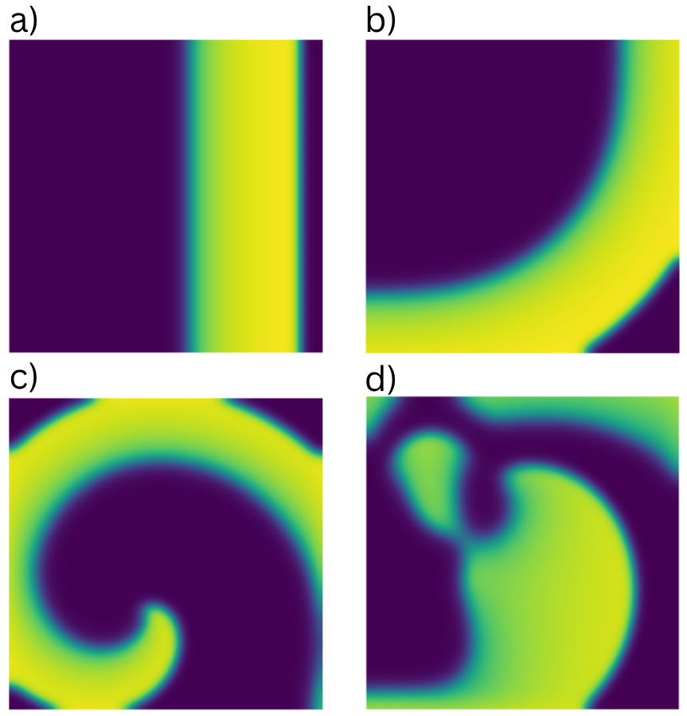

# Data
---

### **Generation Scripts**

- 1. **`data_extraction_openCARP.py`**  
        Constructs a pytorch tensor from simulation outputs from openCARP, with optional downsampling in the spatial and temporal dimensions. 
        The `read_array_igb`, `read_pts`, and `generate_data` functions were adapted from: 
        [https://github.com/pcmlab/openCARP-PINNs](https://github.com/pcmlab/openCARP-PINNs)

- 2. **`data_construction_openCARP.py`**  
        Constructs training, testing and evaluation datasets from the simulation tensors, saving to a new folder and outputting the construction information to a .txt file.  
        To generate a training-testing dataset (split sequentially) with samples pairs of size <input frames> run: 

        ```bash
        python data_construction_openCARP.py -f <path-to-tensors> -iw <input-frames> -ow <output frames> -tr <training percent>
        ```
---

## **Example Datasets**

Contains lightweight example datasets for propagation scenarios: 
- a)planar
- b)centrifugal
- c)stable
- d)chaotic

These datasets are saved with spatial resolution 101 x 101, time resolution 5ms, input-output samples of 5 frames. 

<p align="center">
  
</p>

## **OpenCARP simulation files**

Contains the carputils script, mesh and state files used to generate the ground truth simulation data. 

To run the simulation script:
1. Ensure that all of the necessary requirements are installed from: [https://opencarp.org/](https://opencarp.org/)
2. Build the 'AlievPanfilovDynamic.model' cell model has been into the architecture (follow the [https://opencarp.org/documentation/examples/01_ep_single_cell/04_limpet_fe](example) from the openCARP website)
3. Run:

```bash
python 2D_Waves_AP.py --protocol '<protocol>' <additional arguments>
```