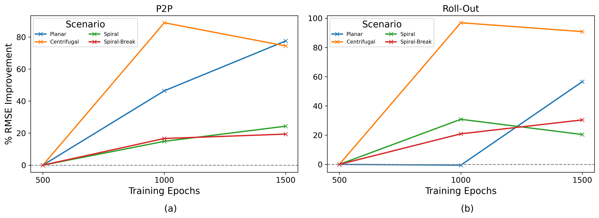

# Paper Results
---

### **Baseline_Results**

- 1. **Baseline_results_200_frame**  
       Results for each of the trained PINO models for each considered propagation scenarios, grouped by the type of frame training and the evaluation method. All evaluation trajectories were fixed at 1000ms. 

- 2. **Baseline_results_500_frame**  
       Results for each of the trained PINO models for stable and chaotic propagation scenarios, grouped by the type of frame training and the evaluation method. All evaluation trajectories were fixed at 2500ms. 

---
### **Epoch Results**

- 1. Results for each of the trained PINO models evaluated on trajectories of 1000ms for planar and centrifugal propagation scenarios, and 2500ms for the stable and chaotic scenarios. 

- 2. Plots demonstrating the change in evaluation RMSE values for each training run. 

  

--
### **Mesh Resolution Results (x10)**

- 1. Results for each of the PINO models for each scenario trained on a low (downsampled) resolution and evaluated on the groudn truth resolution. (trained on 41x41 and evaluated on 401x401). 

- 2. Plots demonstrating the change in evaluation RMSE values for each evaluation resolution

  

--
### **Zero Shot Transfer**

- 1. **Zero_shot_centri2stable** : Compares the predictions on the stable propagation set using the model trained on stable propagation data and on centrifugal propagation data. 

- 2. **Zero_shot_planar2stable** : Compares the predictions on the stable propagation set using the model trained on stable propagation data and on planar propagation data. 
