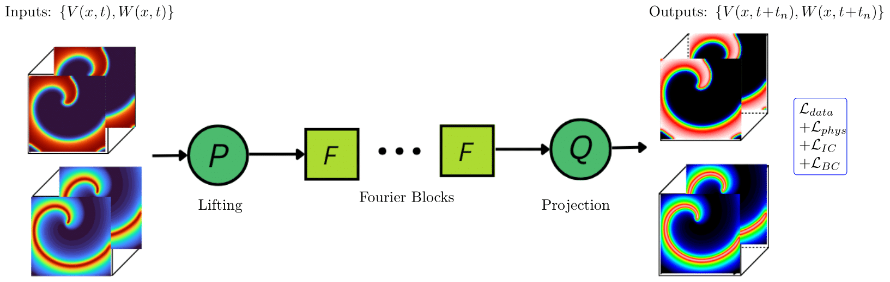

# CardiacEP-PINOs

Repository for the work **"Physics-Informed Neural Operators for Cardiac Electrophysiology"**.

<p align="center">
  
</p>

This repository provides training and evaluation scripts for running a **Physics-Informed Neural Operator (PINO)** model for simulating cardiac electrophysiology propagation scenarios using the **Aliev–Panfilov (AP)** cardiac cell model.  
It also includes the results of the experiments presented in the accompanying paper, including **animations of model predictions**.

---

## Repository Overview

### **Data**
Contains scripts for transforming raw simulation data into **training, testing, and evaluation datasets**, as well as example dataset folders for the **planar**, **centrifugal**, **spiral**, and **spiral-break** propagation scenarios.

### **Paper_Results**
Includes evaluation results for the experiments described in *"Physics-Informed Neural Operators for Cardiac Electrophysiology"*.  
Results cover **baseline tests**, **mesh resolution experiments**, and **zero-shot transfer** evaluations.  
Each results folder includes **side-by-side animations** comparing model predictions with ground truth simulations.

### **Scripts**
- **`PINO_Train.py`**  
  Training script for the PINO model. Supports different model configurations and training parameters.  
  Trained models are saved in timestamped results folders.

- **`Evaluation_P2P.py`**  
  Evaluates the trained model on a **point-to-point basis**, where ground truth inputs are used for each prediction.

- **`Evaluation_Rollout.py`**  
  Evaluates the trained model in a **recursive (rollout) fashion**, using previous model outputs as inputs for subsequent predictions.

- **`Model_Comparison.py`**  
  Compares the performance of multiple trained models on the same evaluation dataset.

---

## Usage

1. **Install Dependencies**  
   Install the `neuraloperator` library following the instructions provided here:  
   [https://github.com/neuraloperator/neuraloperator](https://github.com/neuraloperator/neuraloperator)

2. **Run Training**  
   To train the PINO model on one of the provided datasets, run the training script from the command line:

    ```bash
    python PINO_Train.py -d <dataset_path> -<additional arguments>
    ```

    To inspect optional arguments, run: 

    ```bash
    python PINO_Train.py --help
    ```
---

## Citation
If you use this repository in your work, please cite:  
> *"Physics-Informed Neural Operators for Cardiac Electrophysiology"*  
> (Add ArXiv link)

Additionally, this repository makes use of the Neural Operator library. Please cite:

>"A Library for Learning Neural Operators."
>Kossaifi, J., Kovachki, N., Li, Z., Pitt, D., Liu-Schiaffini, M., Duruisseaux, V., George, R., Bonev, B., Azizzadenesheli, K., Berner, J., and Anandkumar, A.
>arXiv, 2025.
>doi:10.48550/arXiv.2412.10354
---

## Contact
For questions or collaboration inquiries, please contact:  
**[Hannah Lydon]** – [hannah.lydon@kcl.ac.uk]
